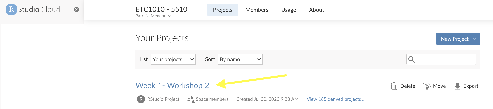
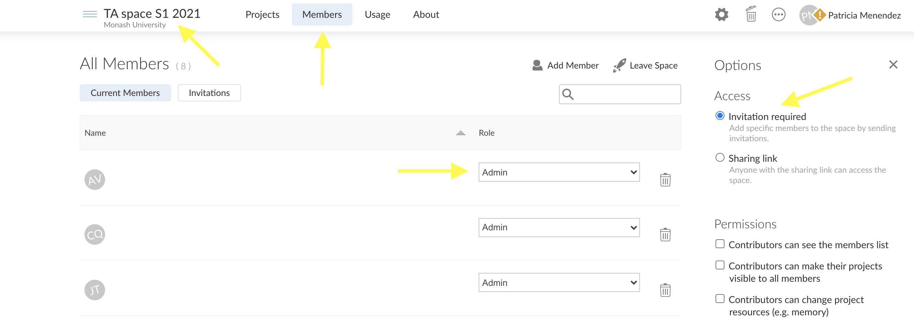

```{r titleslide, child="components/titleslide.Rmd"}
```
```{r setup, include=FALSE}
library(tidyverse)
library(knitr)
library(kableExtra)
library(emo)
opts_chunk$set(echo = FALSE,   
               message = FALSE,
               warning = FALSE,
               collapse = TRUE,
               fig.height = 4,
               fig.width = 8,
               fig.align = "center",
               cache = FALSE)
# options(htmltools.dir.version = FALSE)
```

---
# Teaching in times of COVID

<br>

.pull-left[
Instead of usingclassooms `r emo::ji("point")[3]`
```{r out.width = '120%', echo = FALSE}

```

`r emo::ji("point")`
<br>
Remote and online learning 
 

]
--
.pull-right[

```{r out.width = '50%', echo = FALSE}

```
Common door to learning

]


---
# Student cohort and units
<br>

**Students**

- Both undergraduate and graduate.
- Classroom size range from about 300 to 60 students.

<br>
**Challenges**

- Different backgrounds and coding levels.

<br>
**Units**


- Introduction to data analysis  
```{r out.width = '10%', echo = FALSE, align = "right"}
include_graphics("images/R.png")
```
- Reproducible and Collaborative practices


---
# Goals

**Teaching and Learning Experience**
<br>

- Efficient and effective experience
- Unify student learning
- Remove the installation/usage burdens
- Remote/hybrid learning
]
<br>
**Pedagogy**

- Active learning and constructivism
- Authentic learning: Usage of practical real examples


```{r out.width = '10%', echo = FALSE, align = "right"}
include_graphics("images/hat.png")
```
.small[
Cartoon by Hiclipart.com
]


---
# Approach
<br><br>

.pull-left[
* Programming language
]
.pull-left[
```{r out.width = '20%', echo = FALSE}
knitr::include_graphics("images/R.png")
```
]

.pull-left[
 * Integrated development environment (IDE) 
]

.pull-left[
```{r out.width = '30%', echo = FALSE}
knitr::include_graphics("images/RStudio-Logo-Flat.png")
```
]

<br><br><br>

.content-box-neutral[
  Integrated development environment (IDE) in the **cloud**


```{r out.width = '30%', echo = FALSE}

```

]


---
# Organization and delivery: Lectures
<br>

**Lectures**

<br>

.pull-left[
```{r out.width = '110%', echo = FALSE}

```
]

.pull-right[
```{r out.width = '120%', echo = FALSE}

```
]


---
# Organization and delivery: Tutorials
<br>

**Tutorials**

.pull-left[
```{r out.width = '90%', echo = FALSE}

```
]

.pull-right[
```{r out.width = '90%', echo = FALSE}

```
]

.content-box-neutral[
```{r out.width = '70%', echo = FALSE}

```
]

---
# Rstudio Cloud: Tutorials
<br>
.content-box-neutral[
```{r out.width = '100%', echo = FALSE}

```
]


---
# Teaching team

<br>
.content-box-neutral[
- Chief Examiner / lecturer
- Group of fantastic teaching assistants
]

**Communication / Prep** 
.content-box-neutral[
- Slack channel
- TA dedicated Rstudio Cloud space + Unit space:
    - Unit space admin share with Head Teaching Associate.
    - TA Rstudio Cloud space: Everyone has admin access.
 ]   
    
---
# Teaching associates RStudio Cloud space  

<br>

```{r out.width = '100%', echo = FALSE}

```
    
    - Unit space --> Contributors
    
    
---
class: transition
# Assessment

<br>
.pull-left[
- ## Assignments
- ## Group work
- ## Semester assessment
]
.pull-right[
```{r out.width = '100%', echo = FALSE}
knitr::include_graphics("images/ssc-combined-graduate-level-exam-ssc-cgl-·-2017-paper-common-proficiency-test-electronic-assessment-online-exam-7e520de85b4e8d413ca75210aa492c9b.png")
```
]


---
# Assignments

- Launch and submitted via learning management system (Moodle)

```{r out.width = '80%', echo = FALSE}

```
--
<br>
- RStudio Cloud Assignment space

.content-box-neutral[
```{r out.width = '80%', echo = FALSE}

```
]


---
# Semester Assessment
<br>
.pull-left[
.content-box-neutral[
- Timed exercise (2hrs).
- Launch and submitted via learning management system (Moodle).
- Exercise in Rstudio Cloud.
- Zoom call open for **technical support**.
- Teaching team on Zoom call/ slack channel.
]
]
.pull-right[
```{r out.width = '100%', echo = FALSE, align = "left"}

```

```{r out.width = '40%', echo = FALSE, align = "center"}
include_graphics("images/laptop-computer-icons-computer-monitors-desktop-computers-laptop-png-vector-5495ee1b5c4141f9b9860477ebc62834.png")
```

```{r out.width = '40%', echo = FALSE, align = "right"}
include_graphics("images/rstudio-logo.png")
```
]

---
# Things to keep in mind

<br>

- Accessibility
- Rstudio Cloud users/access
- Connection between Rstudio Cloud - Rstudio
- Emphasize R projects


---
background-image: url("images/zane-persaud-qFn515nfhDs-unsplash.jpg")
background-position: 1% 60%
## .black[It is like fine dining, not only about the food but about the] .black[experience!!]
.small[Photo by <a href="https://unsplash.com/@zapsizzle?utm_source=unsplash&utm_medium=referral&utm_content=creditCopyText">Zane Persaud</a> on <a href="https://unsplash.com/s/photos/dinner?utm_source=unsplash&utm_medium=referral&utm_content=creditCopyText">Unsplash</a>]
  

---

```{r endslide, child="components/endslide.Rmd"}
```


